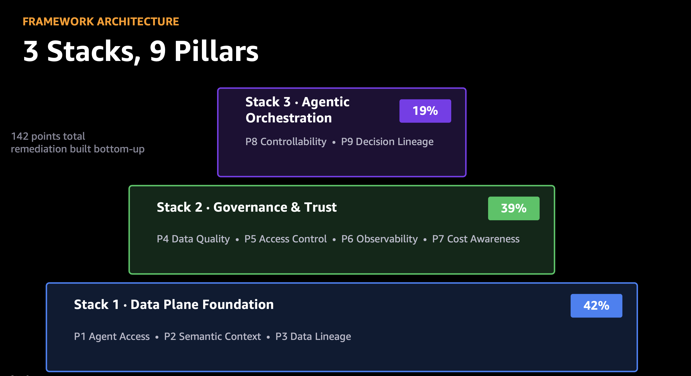
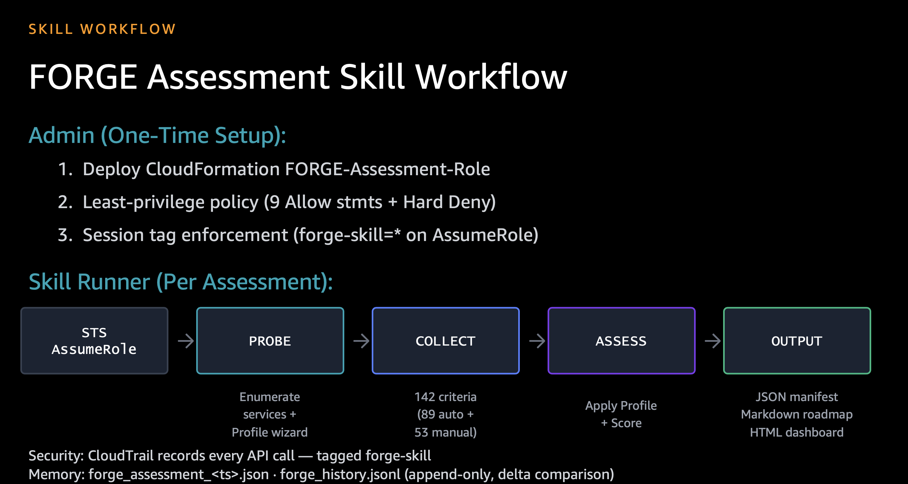
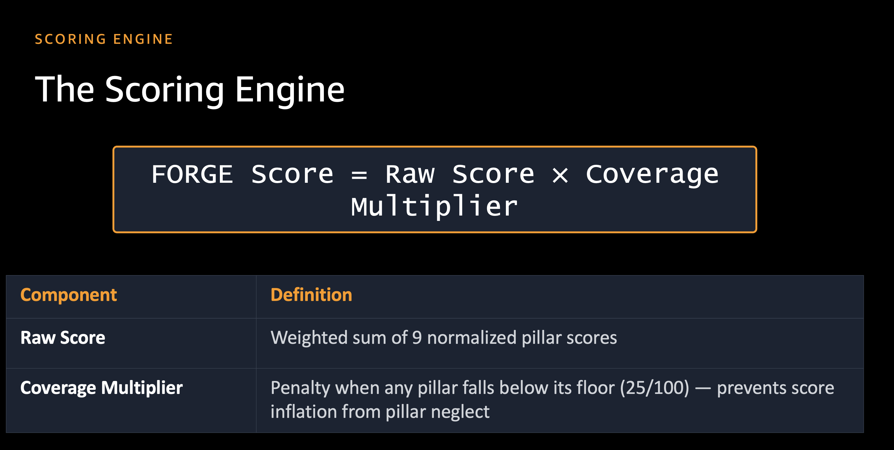
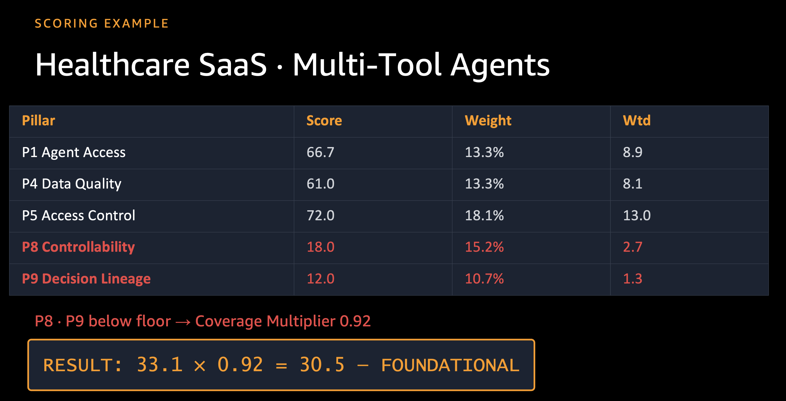

# FORGE — Data for AI Readiness

## FORGE (Foundations for Open, Real-time, Governed Enterprises) 2.4 Assessment Workbench

Continuous diagnostic and improvement framework that scores your data estate readiness for agentic AI workloads. Produces a 0–100 readiness score from criteria across 9 pillars, shaped by a customer-specific FORGE Profile.



Supports **multi-platform** assessments: AWS (API-based discovery) + Databricks (document-first + conversational), with type-aware merging into a single estate score.

## Quick Start



### Single-Platform (AWS Only)

```bash
# 1. Deploy IAM role (one-time)
aws cloudformation deploy \
  --template-file forge/role_provisioner/cfn_template.yaml \
  --stack-name forge-assessment-role \
  --capabilities CAPABILITY_IAM

# 2. Declare profile (first run)
python3 -m forge profile declare \
  --architecture open_lakehouse \
  --workload multi_tool_agents \
  --industry financial_services \
  --agent-maturity single_agent_prod

# 3. Run assessment
python3 -m forge assess --account-id 123456789012 --region us-east-1 --show-delta

# 4. Generate dashboard
python3 forge_dashboard_generator.py forge_output/assessments/forge_assessment_results.json
open forge_output/forge_dashboard.html
```

### Multi-Platform (AWS + Databricks)

```bash
# After AWS assessment completes, run the estate dashboard script
# (uses past AWS results + Databricks skill with uploaded documents)
python3 scripts/generate_estate_dashboard.py
open forge_output/forge_estate_dashboard.html
```

Or use the **Kiro Skill** interactively — it handles the full flow including document upload and follow-up questions.

---

## Using the Kiro Skills (Recommended)

### FORGE Assessment Skill

In Kiro chat, reference `#FORGE Assessment Skill`. The skill will:

1. Help deploy the CloudFormation role
2. Probe your AWS account — discover 30+ services
3. Propose a FORGE Profile — infer Architecture, Workload, Industry, Maturity
4. Run the full assessment pipeline → dashboard
5. **Ask if you have additional platforms** (Databricks) → trigger multi-platform flow

### FORGE Databricks Assessment Skill

Reference `#FORGE Databricks Assessment Skill` directly, or let the main skill trigger it. The document-first flow:

1. Upload Databricks docs (billing CSV from `system.billing.usage`, architecture docs)
2. Parser identifies services + pre-fills criteria from document evidence
3. Review findings → answer targeted follow-ups (max 3/pillar)
4. Produces a Databricks PlatformSegment → merges with AWS → estate score

---

## Scoring Model

```
FORGE Score = Raw Score(effective_weights) × Coverage Multiplier(effective_floors)
```



Worked example — a Healthcare SaaS / multi-tool-agents profile where two pillars fall below their floor, triggering a coverage penalty:



### Multi-Platform Merge Logic

When multiple platforms are assessed, criteria merge using type-aware logic:

| Criterion Type | Merge Rule | Example |
|---|---|---|
| **Binary** | AND across platforms — all must pass | UC API accessible on both AWS + DBX |
| **Analog** | Pooled ratio — sum(num) / sum(den) | AWS: 80/100 + DBX: 20/50 → 100/150 = 66.7% |
| **NOT_APPLICABLE** | Excluded from merge | Criterion only on one platform → only that platform counts |

Single-platform assessments produce identical results to pre-multi-platform behavior (backward compatible).

### FORGE Profile Dimensions

| Dimension | Options |
|-----------|---------|
| Architecture | `open_lakehouse` · `saas_native` · `hybrid` |
| Workload | `rag_retrieval` · `single_tool` · `multi_tool_agents` |
| Industry | `general` · `financial_services` · `healthcare` · `public_sector` |
| Agent Maturity | `pilot` · `single_agent_prod` · `multi_agent_prod` |

### Score Bands

| Band | Range | Meaning |
|------|-------|---------|
| UNREADY | 0–25 | Agentic workloads will fail at the data layer |
| FOUNDATIONAL | 26–50 | Stack 1 remediation in progress |
| GOVERNED | 51–75 | Governance active, production agents viable |
| AGENT-READY | 76–90 | Full agentic workloads, guardrails expected active |
| FORGE-NATIVE | 91–100 | All pillars ≥ 70, eligible for reference architecture |

---

## Project Structure

```
forge-workbench/
├── .kiro/
│   ├── skills/                                ← Kiro Skill definitions (agent instructions)
│   │   ├── forge-assessment.md                  AWS assessment + multi-platform orchestrator
│   │   ├── forge-databricks-assessment.md       Databricks document-first skill
│   │   └── forge-customization.md               Criteria/weight customization
│   └── specs/                                 ← Spec-driven development artifacts
│       ├── forge-assessment-v23-upgrade/        v2.3 upgrade spec
│       └── forge-multi-platform-databricks/     Multi-platform extension spec
│
├── forge/                                     ← Core Python package
│   ├── __main__.py                              CLI entrypoint: `forge profile` + `forge assess`
│   ├── collector.py                             Pipeline orchestrator + estate assessment
│   ├── aws_client.py                            STS AssumeRole with session tags
│   ├── models.py                                Domain dataclasses (incl. multi-platform types)
│   ├── criteria_registry.py                     142 AWS criteria definitions
│   ├── relevance_config_loader.py               Loads pre-computed relevance config
│   │
│   ├── platform_segments/                     ← Multi-platform segment layer
│   │   ├── __init__.py                          Public API: wrap_aws_result, build_estate_result
│   │   ├── aws_adapter.py                       Wraps ForgeAssessmentResult → PlatformSegment
│   │   ├── databricks_registry.py               57 Databricks criteria (6 pillars, 10 services)
│   │   └── databricks_segment.py                Builds Databricks PlatformSegment + state model
│   │
│   ├── scoring_engine/                        ← Score computation
│   │   ├── formula.py                           Raw Score × Coverage Multiplier
│   │   ├── bands.py                             Band classification
│   │   ├── analog.py                            0.0–1.0 ratio scoring
│   │   └── merge.py                             Type-aware criteria merge (AND/pooled) + estate score
│   │
│   ├── skill_support/                         ← Skill Python implementations
│   │   ├── databricks_skill.py                  Databricks skill orchestrator (document-first flow)
│   │   ├── databricks_questions.py              Follow-up question bank (18 questions, 6 pillars)
│   │   ├── probe_runner.py                      AWS probe bridge
│   │   └── config_generator.py                  Relevance config generator
│   │
│   ├── document_ingest/                       ← Document parsing for Databricks skill
│   │   ├── __init__.py                          CostSignal + DocumentEvidence dataclasses
│   │   ├── cost_parser.py                       Databricks billing CSV/PDF parser
│   │   └── config_parser.py                     Architecture/config document parser
│   │
│   ├── profile_engine/                        ← FORGE Profile resolution
│   │   ├── dimensions.py                        Enums + shift vector/floor tables
│   │   ├── weight_resolver.py                   Effective weight computation
│   │   ├── floor_resolver.py                    Effective floor computation
│   │   └── persistence.py                       YAML read/write + lock enforcement
│   │
│   ├── delta_engine/                          ← Score comparison over time
│   │   ├── __init__.py                          DeltaResult + EstateDeltaResult + PlatformDelta
│   │   ├── reader.py                            JSONL history reader
│   │   └── comparator.py                        Delta computation (single + estate + per-platform)
│   │
│   ├── relevance_engine/                      ← AWS service discovery
│   │   ├── probes.py                            30+ concurrent service probes
│   │   ├── validator.py                         Cost Explorer + CloudTrail confidence
│   │   └── classifier.py                        Criterion relevance classification
│   │
│   ├── dashboard/                             ← HTML dashboard generation
│   │   ├── __init__.py                          Exports: generate_dashboard, generate_estate_dashboard
│   │   └── generator.py                         SVG charts, radar toggle, platform badges, remediation
│   │
│   ├── trend_visualizer/                      ← Trend chart for dashboard
│   │   └── chart.py                             Time-series HTML fragment
│   │
│   ├── pillar_assessors/                      ← Deep AWS assessment per pillar
│   │   ├── p1.py … p9.py                       Pillar-specific logic
│   │   └── _common.py                           Shared helpers
│   │
│   └── role_provisioner/
│       └── cfn_template.yaml                    Zero-param CloudFormation (same-account IAM role)
│
├── scripts/
│   └── generate_estate_dashboard.py           ← Multi-platform dashboard generator script
│
├── tests/                                     ← Pytest test suite
│   ├── fixtures/                                Test data (billing CSV, architecture doc)
│   ├── test_merge_properties.py                 Property-based tests (Hypothesis, 6 properties)
│   ├── test_aws_adapter.py                      AWS → PlatformSegment adapter
│   ├── test_cost_parser.py                      Billing CSV parser
│   ├── test_config_parser.py                    Architecture doc parser
│   ├── test_databricks_fallback.py              No-document fallback path
│   ├── test_skill_flow.py                       Skill phase state machine
│   ├── test_e2e_databricks_skill.py             End-to-end Databricks skill
│   ├── test_e2e_multi_doc_skill.py              End-to-end with multiple documents
│   ├── test_estate_assessment.py                Estate assessment + JSON output
│   ├── test_estate_delta.py                     Multi-platform delta computation
│   ├── test_estate_roadmap_md.py                Platform-grouped roadmap
│   ├── test_estate_remediation.py               Dashboard remediation section
│   ├── test_criteria_drilldown.py               Dashboard criteria + platform badges
│   ├── test_radar_toggle.py                     Dashboard radar chart toggle
│   └── ...                                      (formula, persistence, classifier, etc.)
│
├── docs/
│   └── FORGE_Multi_Platform_Scoring_Design.md   Multi-platform design document
│
├── forge_config/                              ← Assessment configuration
│   ├── recommendations.yaml                    Criterion-level remediation guidance
│   ├── partner_solutions.yaml                  Partner product mappings
│   └── weights.yaml                            Base weight reference
│
├── forge_output/                              ← Assessment artifacts (gitignored)
│   ├── assessments/                             Timestamped JSON manifests
│   ├── roadmaps/                                Timestamped markdown roadmaps
│   ├── forge_history.jsonl                      Append-only score history
│   ├── forge_profile.yaml                       Locked profile
│   ├── forge_dashboard.html                     AWS-only dashboard
│   └── forge_estate_dashboard.html              Multi-platform estate dashboard
│
├── forge_dashboard_generator.py               ← Legacy single-platform dashboard script
├── pyproject.toml                             ← Project config (pytest, dependencies)
└── README.md
```

---

## Key Modules Explained

### Relevance Engine — Service Discovery (`forge/relevance_engine/`)

The front door of every AWS assessment. Before scoring anything, FORGE discovers what's actually running in the account so it only evaluates relevant criteria.

- **`probes.py`** — 30+ concurrent, read-only service probes (S3, Glue, Athena, Lake Formation, Redshift, Bedrock, SageMaker, and more). Each probe issues List/Describe/Get metadata calls to detect whether a service is in use.
- **`validator.py`** — Corroborates probe results with Cost Explorer spend and CloudTrail activity to produce a confidence signal, reducing false positives from leftover/unused resources.
- **`classifier.py`** — Turns discovery signals into per-criterion relevance (relevant / not-applicable), so the score reflects the estate you actually run.

### Collector & Pillar Assessors — The Assessment Engine (`forge/collector.py`, `forge/pillar_assessors/`)

The core engine that turns discovery into a scored assessment.

- **`collector.py`** — Pipeline orchestrator. Assumes the read-only role, runs discovery, dispatches the pillar assessors, and assembles the `ForgeAssessmentResult`.
- **`pillar_assessors/p1.py … p9.py`** — Deep, per-pillar assessment logic. Each pillar evaluates its criteria against the discovered services (e.g., governance, lineage, security, quality) and emits binary/analog criterion results.
- **`criteria_registry.py`** — The 142 AWS criteria definitions that the assessors evaluate against.

### Scoring Engine (`forge/scoring_engine/`)

The math that converts criterion results into a 0–100 readiness score.

- **`formula.py`** — `Raw Score(effective_weights) × Coverage Multiplier(effective_floors)` — the core FORGE formula.
- **`analog.py`** — 0.0–1.0 ratio scoring for partial-credit (analog) criteria.
- **`bands.py`** — Classifies the final score into a readiness band (UNREADY → FORGE-NATIVE).

### Dashboard (`forge/dashboard/`)

Turns the assessment result into a self-contained, shareable report.

- **`generator.py`** — Renders an HTML dashboard with SVG score gauge, per-pillar radar chart, criteria drill-down (with pass/fail attribution), and a prioritized remediation roadmap. No server or external dependencies — just open the HTML.
- **`trend_visualizer/chart.py`** — Time-series trend fragment sourced from `forge_history.jsonl`, so you can see readiness improve across runs.

### Multi-Platform Extension (`forge/platform_segments/`, `forge/scoring_engine/merge.py`)

Optional layer that lets FORGE score more than just AWS (e.g., Databricks) and combine them into one estate score. Single-platform (AWS-only) assessments are unaffected — this layer is a pass-through when only one platform is present.

- **`platform_segments/aws_adapter.py`** — Wraps the AWS `ForgeAssessmentResult` into a platform-neutral `PlatformSegment` without changing the collector.
- **`scoring_engine/merge.py`** — Merges criteria across platforms (AND for binary, pooled ratio for analog) and computes the combined estate score.
- **`document_ingest/`** & **`skill_support/`** — Support the document-first Databricks flow (billing/config parsing and the Kiro skill state machine). Only exercised when a second platform is assessed.

---

## Multi-Platform Dashboard

The estate dashboard (`forge_output/forge_estate_dashboard.html`) shows:

- **Estate Score** gauge (primary) + per-platform badges (secondary)
- **Radar chart** with toggle: Combined | AWS | Databricks
- **Criteria drill-down** with platform badge column + failure attribution
- **Remediation roadmap** grouped by platform (AWS → AWS services, Databricks → UC/DLT/etc.)

When only one platform is assessed, the dashboard renders identically to the single-platform version — no toggle controls or platform badges.

---

## Testing

```bash
# Run all tests
python3 -m pytest tests/ -v

# Run property-based tests only (merge engine correctness)
python3 -m pytest tests/test_merge_properties.py -v

# Run end-to-end Databricks skill flow
python3 -m pytest tests/test_e2e_multi_doc_skill.py -v -s

# Run with coverage
python3 -m pytest tests/ --cov=forge --cov-report=term-missing
```

### Test Categories

| Category | Files | What it validates |
|----------|-------|-------------------|
| Property-based | `test_merge_properties.py` | 6 formal correctness properties via Hypothesis |
| Unit | `test_aws_adapter.py`, `test_cost_parser.py`, `test_config_parser.py` | Individual module behavior |
| Integration | `test_skill_flow.py`, `test_estate_assessment.py` | Multi-module interaction |
| End-to-end | `test_e2e_databricks_skill.py`, `test_e2e_multi_doc_skill.py` | Full skill flow with fixtures |
| Dashboard | `test_radar_toggle.py`, `test_criteria_drilldown.py`, `test_estate_remediation.py` | HTML output correctness |

---

## Security Model

- **Least-privilege grants**: Only specific read-only metadata actions (no wildcards)
- **No data reads**: `s3:GetObject`, `dynamodb:GetItem` never granted
- **No mutations**: No Create/Delete/Put/Update actions
- **Session tagging**: Every API call traceable in CloudTrail (`forge-skill-*`)
- **1-hour TTL**: Temporary credentials expire automatically
- **Databricks assessment**: No API access needed — uses uploaded documents + conversation

> **⚠️ Handle assessment output as sensitive.** Files written to `forge_output/`
> (dashboards, `forge_history.jsonl`, roadmaps) contain account-specific metadata
> such as resource inventories and IAM role/policy listings. `forge_output/` is
> gitignored by default — do not commit it, and treat these reports as internal
> when sharing.

### Operator guidance (run safely)

- **Run with least privilege.** Run FORGE from a limited-privilege IAM principal —
  not an admin/root identity. The assessment only needs to assume
  `FORGE-Assessment-Role` (read-only). Avoid running it with a principal that holds
  broad `iam:PassRole` or unrestricted `sts:AssumeRole`.
- **Restrict who can assume the role.** The role trusts the same-account root and
  requires the `forge-skill` session tag. For defense-in-depth, apply an SCP or IAM
  permission boundary limiting which principals may assume `FORGE-Assessment-Role`.
- **Verify tool integrity before running.** Pull FORGE from the official
  `aws-samples` source and verify the git tag/commit before executing, since the
  tool runs with your credentials.
- **Verify output integrity.** Each run prints a SHA-256 of the results file.
  Regenerate reports rather than trusting a copy from a shared/network location.

---

## Requirements

- Python 3.9+
- boto3 (pinned — see `pyproject.toml`)
- PyYAML (pinned — see `pyproject.toml`)
- pytest + hypothesis (test extras)

```bash
pip install -e .          # runtime deps, pinned
pip install -e '.[test]'  # + test deps
```

---

## Continuous Monitoring

Each assessment appends to `forge_output/forge_history.jsonl`. Multi-platform records include:

```json
{
  "estate_score": 52.8,
  "estate_band": "GOVERNED",
  "platform_scores": {"aws": 44.8, "databricks": 65.2},
  "platforms_assessed": ["aws", "databricks"],
  "pillar_scores": {"P1": 65.0, "P2": 55.0, ...}
}
```

The delta engine (`compute_estate_delta`) handles:
- Estate-level deltas (current vs previous)
- Per-platform deltas (when both assessments have that platform)
- New platform detection: reported as "newly assessed" rather than delta-from-zero
